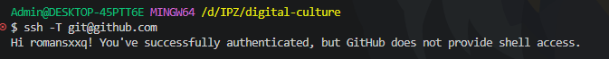
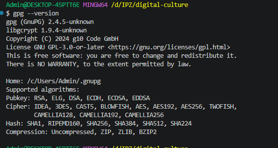
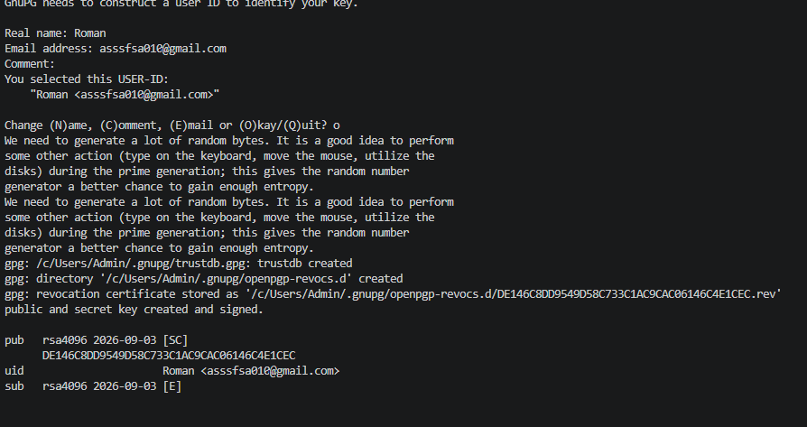
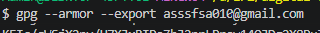
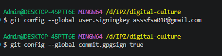
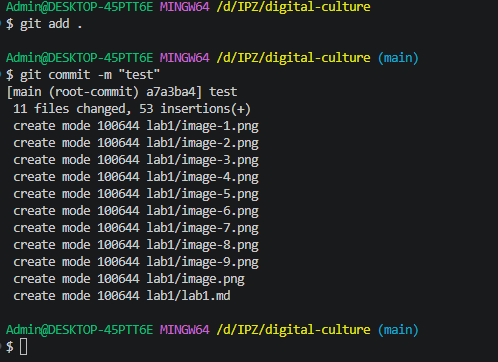

# Лабораторна робота №1
## Тема: Налаштування безпечний доступ в GitHub
### Студент: Роман Матвійчук
### Група: ІПЗ-4/2

### 1. Безпечний доступ до Git.

Для безпечної роботи з GitHub я налаштував доступ до репозиторію за допомогою SSH-ключа. Використання SSH дозволяє виконувати операції з репозиторіями без необхідності постійно вводити пароль від облікового запису GitHub.

Створив ssh-ключ в терміналі.

Під час створення ключа я вказав місце його збереження та захисну фразу.

Після створення ключа я отримав його відкриту частину командою

Отриманий відкритий ключ я скопіював та добавив до свого облікового запис GitHub у розділі Settings і в SSH and GPG keys.

Після цього я перевірив правлильність налаштування з'єднання SSH за допомогою команди:

### 2. Підпис комітів за допомогою GPG
Наступним етапом роботи було налаштування цифрового підпису Git-комітів за допомогою GPG-ключа.

Спочатку перевірив наявність GPG на ноутбуці.

Після цього створив новий GPG ключ за допомогою команди.

Під час створенння я вказав необхідні параметри, ім'я та електрону пошту, яка прив'язана в моєму github акаунті.

Далі я експортував відкриту частину ключа

Отриманий відкритий ключ я додав до GitHub у розділі Settings, далі в SSH and GPG keys і в New GPG key.

Після цього я налаштував Git для використання створеного ключа.

Таким чином, Git було налаштовано на автоматичне підписування нових комітів.

Після внесення змін до репозиторію я створив тестовий коміт

Після відправлення коміту на GitHub я перевірив його статус. Біля коміту відображається зелена позначка Verified, що підтверджує справжність цифрового підпису.
іі
